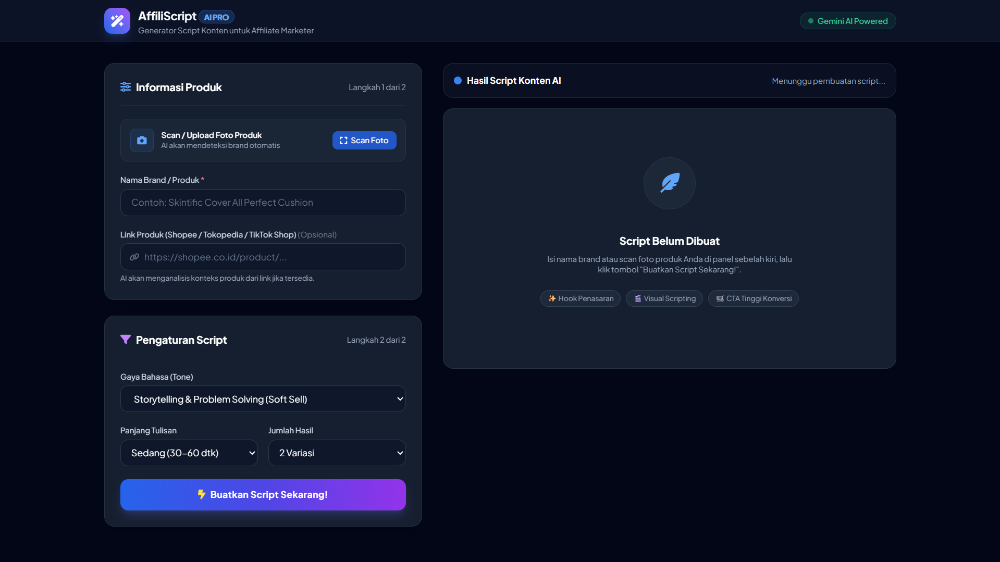
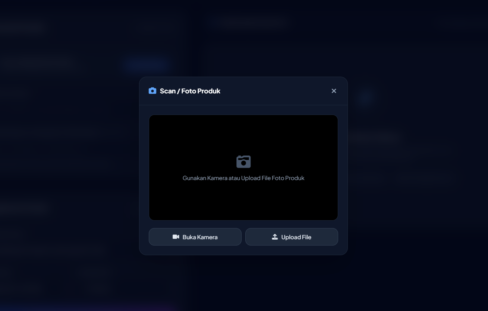
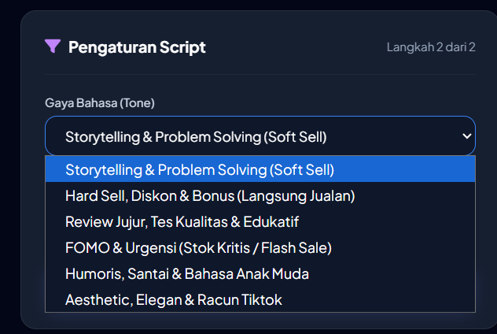
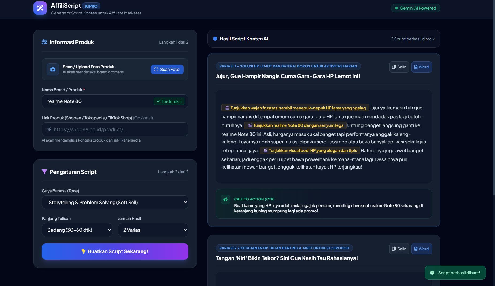

# AffiliScript

AffiliScript merupakan aplikasi berbasis web yang dibuat untuk membantu affiliate marketer dalam membuat script konten promosi secara lebih praktis. Website ini menyediakan fitur scan atau upload foto produk, pengisian informasi produk, pengaturan gaya bahasa, pembuatan beberapa variasi script, serta fitur untuk menyalin dan mengekspor hasil script.

---

## Dokumentasi

### 1. Halaman Utama

Halaman utama merupakan tampilan awal aplikasi AffiliScript. Pada halaman ini pengguna dapat memasukkan informasi produk melalui nama brand atau produk dan link produk. Selain itu, tersedia fitur **Scan Foto** untuk mengambil atau mengunggah foto produk.

Pada bagian kanan halaman terdapat area hasil script yang akan menampilkan hasil setelah proses pembuatan script selesai.

---

### 2. Scan / Foto Produk

Fitur Scan / Foto Produk digunakan untuk memasukkan foto produk ke dalam aplikasi. Pengguna dapat memilih **Buka Kamera** untuk mengambil foto secara langsung menggunakan kamera perangkat atau memilih **Upload File** untuk mengambil foto yang sudah tersimpan di perangkat.

Foto yang dimasukkan dapat digunakan untuk membantu mendeteksi informasi produk secara otomatis.

---

### 3. Pengaturan Script

Pada bagian Pengaturan Script, pengguna dapat menentukan karakteristik script yang ingin dibuat.

Terdapat beberapa pilihan yang dapat disesuaikan, seperti:

* Gaya bahasa atau tone
* Panjang tulisan
* Jumlah variasi script

Gaya bahasa yang tersedia meliputi **Storytelling & Problem Solving, Hard Sell, Review Jujur & Edukatif, FOMO & Urgensi, Humor & Santai, serta Aesthetic & Elegan**.

---

### 4. Proses Pembuatan Script

Setelah informasi produk dan pengaturan script selesai ditentukan, pengguna dapat menekan tombol **Buatkan Script Sekarang!**.

Sistem kemudian memproses informasi yang diberikan dan menghasilkan script sesuai dengan pengaturan yang dipilih.

Pengguna dapat menentukan jumlah variasi sehingga dapat memperoleh beberapa pilihan script untuk produk yang sama.

---

### 5. Hasil Script

Hasil script akan ditampilkan pada bagian kanan halaman setelah proses pembuatan selesai.

Setiap hasil memiliki informasi seperti:

* Variasi script
* Judul atau hook konten
* Isi script
* Arahan visual
* Call To Action (CTA)

Arahan visual ditampilkan di dalam script untuk membantu pengguna mengetahui bagian yang dapat ditampilkan atau dilakukan saat membuat video konten.

---

### 6. Fitur Copy Script

Pada setiap hasil script tersedia tombol **Salin** yang dapat digunakan untuk menyalin script secara langsung.

Fitur ini memudahkan pengguna ketika ingin memindahkan hasil script ke aplikasi lain untuk digunakan atau diedit kembali.

---

### 7. Export Script ke Word

Selain menyalin script, pengguna juga dapat menggunakan tombol **Word** untuk mengekspor hasil script ke dalam format dokumen yang dapat dibuka menggunakan Microsoft Word.

Fitur ini dapat digunakan untuk menyimpan script dan menggunakannya kembali di kemudian hari.

---

## Fitur Utama

* Scan produk menggunakan kamera
* Upload foto produk
* Pendeteksian informasi produk dari foto
* Input nama brand atau produk
* Input link produk
* Pilihan gaya bahasa
* Pengaturan panjang tulisan
* Pengaturan jumlah variasi script
* Pembuatan script secara otomatis
* Hook konten
* Arahan visual untuk pembuatan video
* Call To Action (CTA)
* Copy script ke clipboard
* Export script ke Word
* Tampilan hasil dalam beberapa variasi

---

## Penutup

AffiliScript dibuat sebagai aplikasi berbasis web yang membantu proses pembuatan konten affiliate menjadi lebih praktis. Dengan adanya fitur kamera, upload foto produk, pengaturan gaya penulisan, pembuatan beberapa variasi script, serta fitur copy dan export ke Word, pengguna dapat memperoleh referensi script konten dengan lebih cepat dan terstruktur.
